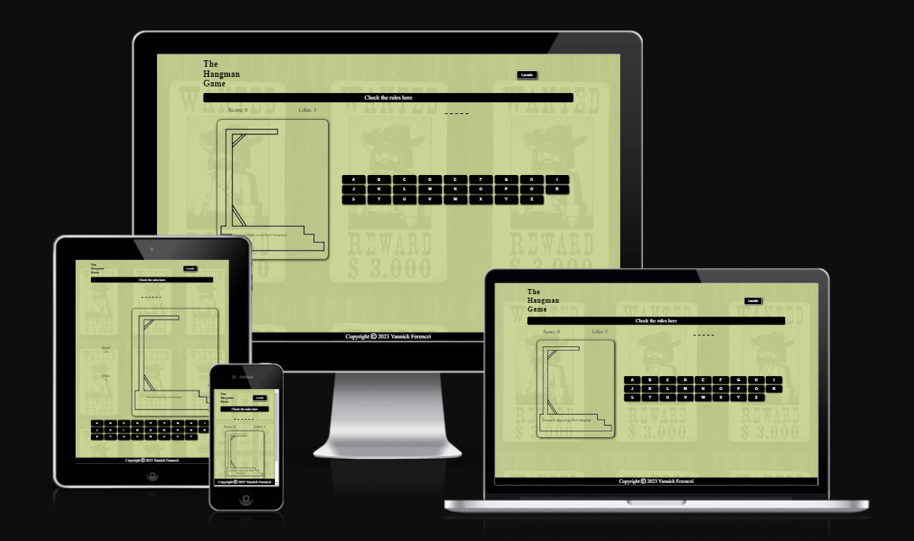
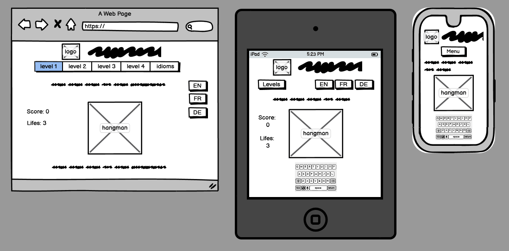
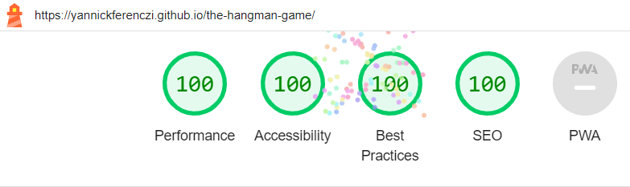
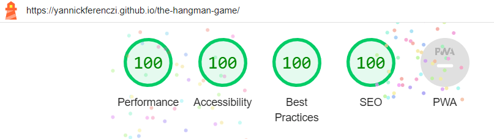
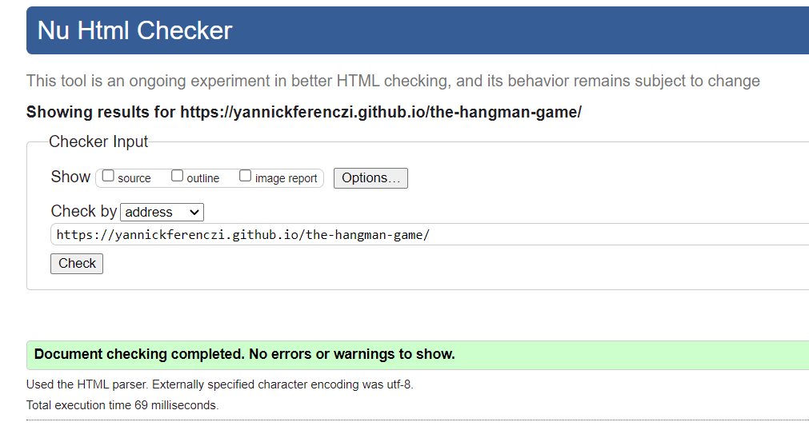
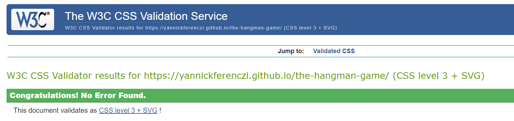
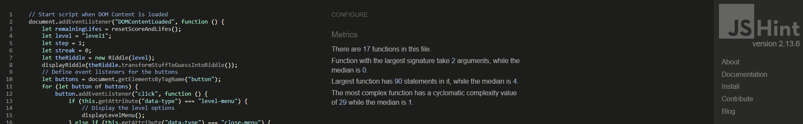

# The Hangman Game

(Developer: Yannick Ferenczi)

This is a web application of the famous 'Hangman Game'. It allows the user to play online. The goal is to guess the secret word or expression before the figure is hung.

[Visit the live project here](https://yannickferenczi.github.io/the-hangman-game/)

---
## Table of Contents

- [The Hangman Game](#the-hangman-game)
  - [Table of Contents](#table-of-contents)
  - [User experience](#user-experience)
    - [Target Audience](#target-audience)
    - [User stories](#user-stories)
  - [Design](#design)
    - [Color](#color)
    - [Structure](#structure)
    - [Features](#features)
    - [Wireframe](#wireframe)
  - [Technologies Used](#technologies-used)
    - [Languages](#languages)
    - [Frameworks and other Programs](#frameworks-and-other-programs)
  - [Testing](#testing)
    - [Performance and Accessibility](#performance-and-accessibility)
    - [Validator Testing for syntaxe errors](#validator-testing-for-syntaxe-errors)
  - [Bugs](#bugs)
  - [Deployment](#deployment)
    - [How this project was deployed](#how-this-project-was-deployed)
    - [How to clone the repository](#how-to-clone-the-repository)
  - [Credits](#credits)
    - [Content](#content)
    - [Media](#media)
  - [Acknowledgements](#acknowledgements)

---
## User experience

### Target Audience

The target audience for the Hangman Game can include:

- People who want to play online
- People who want to improve their vocabulary
- People who want to learn new idioms

### User stories

1. First Time Visitor Goals
   - As a First Time Visitor, I want to easily understand the main purpose of the website.
   - As a First Time Visitor, I want to be able to understand how to play.
2. Returning Visitor Goals
   - As a Returning Visitor, I want a number of riddle to be really high as I do not want to already know what are the secret words.
   - As a Returning Visitor, I want to know my score and my remaining lifes.
3. Frequent User Goals
   - As a Frequent User, I want to have everything on the same page to optimize the time I spend on the application.
   - As a Frequent User, I want to be able to play on any of my devices and always have all the information relative to the game visible without scrolling.

---
## Design

The design has been kept as simple as possible for the user to easily find the needed information while playing. The full game area (riddle, score and lifes, hangman and typing area) should all be visible without scrolling for a best user experience. The application uses a mobile-first approach development as it is expected to mostly play it on a mobile phone.

### Color

The hangman game remind me on the first black and white western movies taking place in the old USA. Therefore, I wanted to keep the application black and white and a little touch of yellow-brown to refer to the sandy desert of Texas.

### Structure

Everything happens on the same page and the interactions are entirely handled with JavaScript. Therefore, if the page is reloaded, the score and the lifes will be reset to default.

### Features

1. Features related to the game implementation

| Code | Description |
| ------- | -------- |
| F01 | The game has a level selection to give users more playing options |
| F02 | The game has a score calculation to keep track of the total score when playing more riddles |
| F03 | The game has a remaining lifes calculation to challenge players |
| F04 | The game has a rules section explaining how to play, how to make points and some bonus calculations. This section is hidden to optimize the clarity of the game |
| F05 | The game has a typing area allowing users to submit their guessed letters |
| F06 | The game has a draw area to illustrate at which stage users are from hanging |
| F07 | The game provides a readable information of how many steps are left before hanging for users who are not familiar with the application to know how many tries left they have before hanging |

2. Features related to the website utilisation

| Code | Description |
| ------- | -------- |
| F08 | The site has a favicon to help users finding the tab back when navigating to other pages |
| F09 | The site has a responsive design, allowing users to play on any device |

3. Features which could be implemented with more time

- Add sound effects when the users ate playing to give a more entertaining feedback to their actions.
- Implement event listeners related to the keyboard, giving users more options to play.
- Implement the game for more languages. The traduction of the website would not be a big effort but the lists of secret words would need to be stored in separate files instead of being in the script.
- Add a Hint option, allowing users to display a letter of the riddle for free (against some compromises on the score).
- Track the best score when users play more game in a row to help them know if they beat their own scores.

### Wireframe

The wireframes have been created without holding back ideas. Therefore, some features, which could be nice to have on the project, have actually not been implemented on the final version because of a lack of capacity. For example the project has only been developed in english. The french and german part could be implemented later.

---
## Technologies Used

### Languages

- HTML5
- CSS3
- JavaScript

### Frameworks and other Programs

- Balsamiq has been used for the wireframes.
- Font Awesome has been used to display the copyright icon.
- Paint has been used to create the favicon and the draws of the hangman.
- Tinypng has been used to reduce the size of the images.
- Git has been used to version control the project.
- GitHub has been used to cloudify and deploy the project.
- CodeAnywhere has been used as an IDE to develop the project.

---
## Testing

### Performance and Accessibility

A lighthouse test has been performed and the results can be seen below:
- for mobile 
  
- for desktop 
  

### Validator Testing for syntaxe errors

- W3C markup validator results
  
- W3C CSS validator results
  
- jshint results
  

---
## Bugs

When clicking on the level-menu button, the first heading does not stay where it belong.
Bug fixed by setting the value of the css property grid-row-start of the first heading to 1.

The lists of secret words should be storaged in separated json files to keep the data out of the script. But for some reasons, even though the data could be read with the script, they could not be used while playing. I did not really understand the issue nor how to fix it. I have then decided to carry on having the data as a dictionnary in the script.js file.

The levels could be reconsidered as it seems to be much more complicated to guess a short word than a long one (as there is more chance to be a match when the word has more letters). A new points calculation would then need to be implemented.

To have some sound effects playing during the game would be a great entertainment for the user. Unfortunately, in this area of expertise too, I did not really understand why the sounds could not be played nor how to fix that issue.

---
## Deployment

### How this project was deployed

1. In the GitHub repository, navigate to the Settings tab, then choose Pages from the left hand menu.
2. From the source section drop-down menu, select the Master Branch and click on the 'save' button.
3. Refresh the page after a few minute to display the link to the live webpage.
4. Any changes pushed to the master branch will take effect on the live project.

[Visit the live project here](https://yannickferenczi.github.io/the-hangman-game/)

### How to clone the repository

1. Go to the <https://github.com/yannickferenczi/the-hangman-game> repository.
2. Click the 'Code' button to the right of the screen, then click HTTPs and copy the link.
3. Open a GitBash terminal and navigate to the directory where you want to locate the clone.
4. On the command line, type "git clone" then paste in the copied url and press the Enter key to begin the clone process.

---
## Credits

### Content

- The secret words have been imported from [7esl](https://7esl.com/) and formated by the developer to harmonise its usage in the script.
- The full content has been created by the developer.

### Media

- The background image has been downloaded for free from [Pixabay](https://pixabay.com/) (Big thanks to the creator: mhdhg)
- All the hangman draws as well as the favicon have been created by the developer using paint.

---
## Acknowledgements

- A huge thanks to my wife for letting me spend hours on this project, even though in that period we got married and welcomed our little daughter in our wonderful world.
- Thank you to Code Institute for their program to become a full stack software developer allowing me to code this project after less than 3 weeks of learning.
