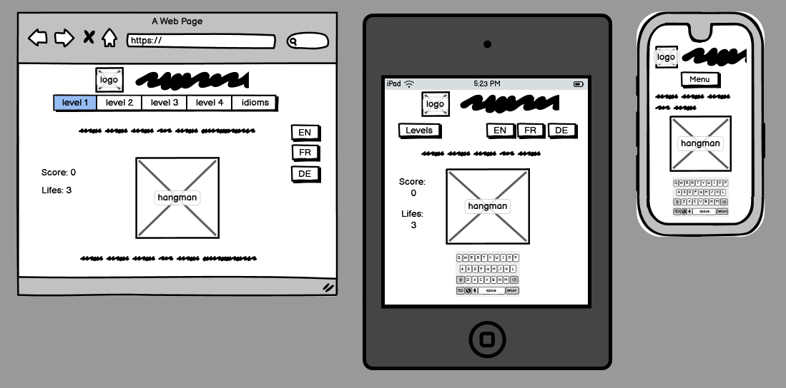

# The Hangman Game

(Developer: Yannick Ferenczi)

This is a web application of the famous 'Hangman Game'. It allows the user to play online. The goal is to guess the secret word or expression before the figure is hung.

[Visit the live project here](https://yannickferenczi.github.io/the-hangman-game/)

## Table of Contents

- [The Hangman Game](#the-hangman-game)
  - [Table of Contents](#table-of-contents)
  - [User experience](#user-experience)
    - [Target Audience](#target-audience)
    - [User stories](#user-stories)
  - [Design](#design)
    - [Color](#color)
    - [Structure](#structure)
    - [Wireframe](#wireframe)
  - [Technologies Used](#technologies-used)
    - [Languages](#languages)
    - [Frameworks and other Programs](#frameworks-and-other-programs)
  - [Testing](#testing)
  - [Bugs](#bugs)
  - [Deployment](#deployment)
  - [Credits](#credits)
  - [Acknowledgements](#acknowledgements)

## User experience

### Target Audience

The target audience for the Hangman Game can include:

- People who want to play online
- People who want to improve their vocabulary
- People who want to learn new idioms

### User stories

1. First Time Visitor Goals
   - As a First Time Visitor, I want to easily understand the main purpose of the website.
   - As a First Time Visitor, I want to be able to understand how to play.
2. Returning Visitor Goals
   - As a Returning Visitor, I want a number of riddle to be really high as I do not want to already know what are the secret words.
3. Frequent User Goals
   - As a Frequent User, I want to have everything on the same page to optimize the time I spend on the application.
   - As a Frequent User, I want to be able to play on any of my devices and always have all the information visible without scrolling.

## Design

The design has been kept as simple as possible for the user to easily find the needed information while playing. The full game area (riddle, score and lifes, hangman and typing area) should all be visible without scrolling for a best user experience.

### Color

The hangman game remind me on the first black and white western movies taking place in the old USA. Therefore, I wanted to keep the application black and white and a little touch of yellow-brown to refer to the sandy desert of Texas.

### Structure

Everything happens on the same page and the interactions are entirely handled with JavaScript. Therefore, if the page is reloaded, the score and the lifes will be reset to default.

### Wireframe

The wireframes have been created without holding back ideas. Therefore, some features, which could be nice to have on the project, have actually not been implemented on the final version because of a lack of capacity. For example the project has only been developed in english. The french and german part could be implemented later.

## Technologies Used

### Languages

- HTML5
- CSS3
- JavaScript

### Frameworks and other Programs

- Balsamiq has been used for the wireframes.
- Font Awesome has been used to display the copyright icon.
- Paint has been used to create the favicon and the draws of the hangman.
- Tinypng has been used to reduce the size of the images.
- Git has been used to version control the project.
- GitHub has been used to cloudify and deploy the project.
- CodeAnywhere has been used as an IDE to develop the project.

## Testing

## Bugs

When clicking on the level-menu button, the first heading does not stay where it belong.
Bug fixed by setting the value of the css property grid-row-start of the first heading to 1.

The lists of words or expressions to guess are contained in some json file. Nevertheless, it seems that those files cannot be access to as long as they are on my machine and not on a server.
To fix this, I provided a shorter list for the development phase, until the project is deployed.

## Deployment

## Credits

## Acknowledgements
